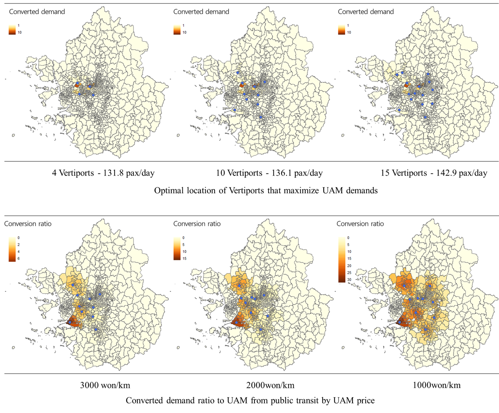

1. [Human Mobility](#1-human-mobility)
2. [Urban Mobility Operation System](#2-urban-mobility-operation-system)
3. [Big Data in Transportation & Mobility](#3-big-data-in-transportation--mobility)
4. [A.I. in Transportation & Mobility](#4-ai-in-transportation--mobility)

---

## **1. HUMAN MOBILITY**
### **Long-term evolution pattern of inter-city travel network**

Investigate how the inter-city travel network evolves over 40 years using freeway and railway travel data. See detailed visualizations at [here](https://jihoyeo.github.io/inter-city_network/). This research is being conducting in collaboration with Jisup Shim and Kitae Jang.

{: width="100%" height="100%"}{: .center}

 

### **Changes in car and bus usage amid the COVID-19 pandemic**

Temporal patterns of confirmed cases of COVID-19, car usage, and bus usage during the study period. The trip-chain data set has 32,488,484 trip-chains for bus travel and 99,024,947 trip-chains for car travel during the temporal scope—February to April 2020.
This research was conducted in collaboration with Suji Kim and Kitae Jang.

{: width="100%" height="100%"}{: .center}

---

## **2. URBAN MOBILITY OPERATION SYSTEM**

### **Vehicle relocation algorithm for Mobility-on-Demand System**

Propose a real-time autonomous mobility-on-demand (AMoD) operation model that includes dynamic relocation of idle vehicles. We structure the original system-level problem into a bi-level framework with the inter-zonal and inter-zonal relocation. This research was conducted in collaboration with Jinwoo Lee, Sujin Kim, and Kitae Jang.

{: width="100%" height="100%"}{: .center}

 

### **Construct Digital Twin for urban mobility operation system**

Construct the digital twin framework for urban mobility operation system. In the digital twin framework, various algorithms (dispatch, routing, relocation) and strategies (carpooling, dynamic pricing, etc.) can be tested for operating mobility system efficiently. This research is being conducting in collaboration with Hyukjoo Yeon, Taebum Yum, and Kitae Jang. See 1-day visualization [here](https://deckgl-trip-layer-xfyqvd.stackblitz.io)

{: width="100%" height="100%"}{: .center}

---

## **3. BIG DATA IN TRANSPORTATION & MOBILITY**

### **Effect of speed humps on vehicle speed and crash severity**

To evaluate the effectiveness of speed humps, the speed profiles of vehicles passing speed humps were analyzed along with pedestrian crash records near speed humps. This research was conducted in collaboration with Jooyoung Lee and Kitae Jang.

{: width="100%" height="100%"}{: .center}

 

### **Optimal Location of Vertiport for Urban Air Mobility (UAM)**

Using Smartcard data in Seoul Metropolitan Areas, converted passenger demands to UAM from public transit were estimated. Based on converted demand, optimal locations of vertiports are also derived that maximize UAM demands. This research was conducted in collaboration with Yeongmin Kwon and Suji Kim.

{: width="100%" height="100%"}{: .center}

---

## **4. A.I. IN TRANSPORTATION & MOBILITY**

### **Traffic demand prediction**

Construct Graph Convolutional Network to reflect both spatial and temporal dependencies that often characterize Origin-Destination traffic demands. The performance of the model is tested using the inter-city travel data of Korean highways from 2015 to 2019.

{: width="100%" height="100%"}{: .center}

 

### **Crash rish prediction using Deep learning**

Predicting the risk of traffic crashes using machine learning techniques (XGBoost). In a grid unit of 1km by 1km, the crash risk for the next 3 hours is predicted and validated.

{: width="100%" height="100%"}{: .center}

 

### **Estimated Time of Arrival in food delivery system**

Develop prediction model of estimated time of arrival (ETA) of Food delivery system. There is greater uncertainty in food delivery than in other ETA models: 1) There are various participants (delivery/restaurant/orderer). 2) The uncertainty of the forecast is very large. 

{: width="100%" height="100%"}{: .center}
